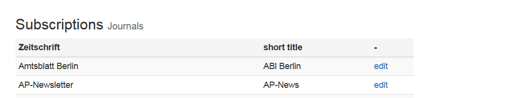

# ZSIV 

## send journal digests to subscribers

 ZSIV (Zeitschrifteninhaltsverzeichnisse) is a tool to send journal digests to a list of subscribers via email. The package comes as a web app and was written in django using MySQL as a database. 
You mantain subscribers, journals, and subsciptions of the former to the latter as well as summaries / digests for each journals. The program compiles an email list based on subscription status of the subscribers and the send status of a specific digest. Use a send button to send unsent summaries.

## Installation

Clone it, install requirements, and use django admin tools to deploy. The program uses as free sendgrid subsciption to do the emailing. 

## Screenshots: 

##  Journals

## Subscriptions

## Summaries

## Queue

## Email Text Form

# TODO

* View to delete Summaries needs to be rewritten.
* Internationalization - currently a blend of English and German

